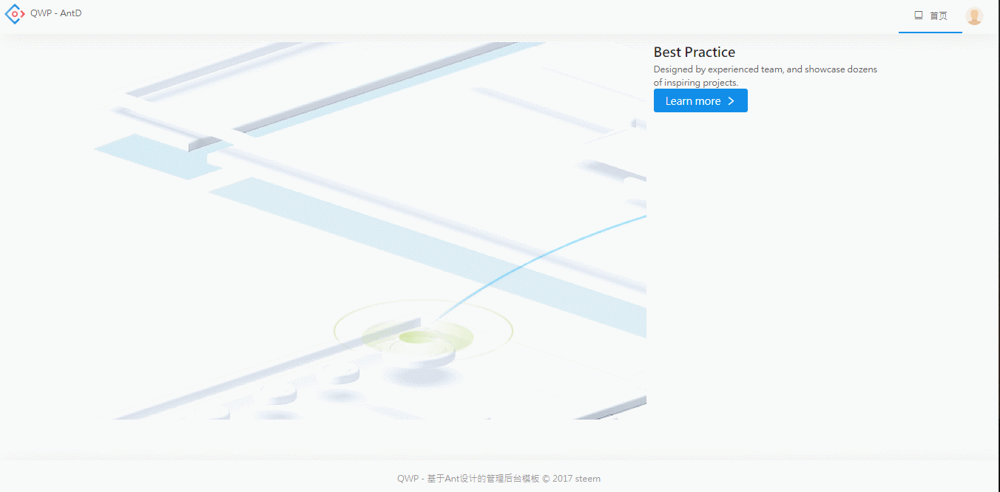
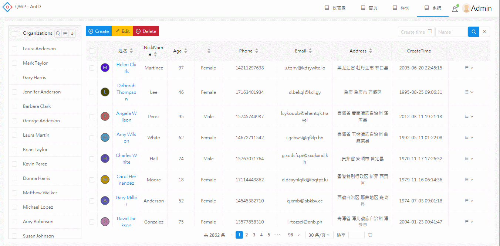

# QWP-Antd Admin

基于[qwp](https://github.com/steem/qwp)和[antd](https://github.com/dvajs/dva)的后台管理页面模板

## 特性
-   前端和后端共享表单验证代码
-   自动生成前端表单
-   自动填充前端表单数据
-   前端和后端共享国际化语言文件
-   用户权限控制（开发阶段可按目录自动生成所有权限）
-   前端和后端代码分离，后端services代码可用任意语言编写
-   根据用户权限自动调整页面布局
-   完整的CRUD样例
-   提供Notification和用户信息菜单样例
-   列表控件样例（支持搜索、排序和分页）
-   表格控件样例（支持搜索、排序和分页）
-   对话框高度和宽度自适应
-   采用react-perfect-scrollbar作为滚动条
-   按样例代码自动生成脚手架代码

## Antd-特性

-   基于[react](https://github.com/facebook/react)，[ant-design](https://github.com/ant-design/ant-design)，[dva](https://github.com/dvajs/dva)，[Mock](https://github.com/nuysoft/Mock) 企业级后台管理系统最佳实践。
-   基于Antd UI 设计语言，提供后台管理系统常见使用场景。
-   基于[dva](https://github.com/dvajs/dva)动态加载 Model 和路由，按需加载。
-   使用[roadhog](https://github.com/sorrycc/roadhog)本地调试和构建，其中Mock功能实现脱离后端独立开发。
-   浅度响应式设计。

详情请参考[dva](https://github.com/dvajs/dva)

## 自动生成表单代码样例

``` javascript
class LoginForm extends React.Component {
  render() {
    const formProps = {
      formName: 'login',
      fields: [{
        id: 'user',
        input: 'text',
        placeholder: l('Username'),
        inputProps: {
          size: 'large',
          onPressEnter: this.props.handleOk,
        },
        addonBefore: {
          id: 'area',
          select: [{
            name: l('Beijing'),
            value: 'bj',
          }, {
            name: l('Shenzhen'),
            value: 'sz',
          }],
          defaultValue: 'bj',
          placeholder: l('Please select area'),
        }
      }, {
        id: 'pwd',
        input: 'password',
        placeholder: l('Password'),
        inputProps: {
          size: 'large',
          onPressEnter: this.props.handleOk,
        },
      }, {
        id: 'role',
        select: [{
          name: l('User'),
          value: 'user',
        }, {
          name: l('Administrator'),
          value: 'admin',
        }],
        defaultValue: 'user',
        placeholder: l('Please select role'),
        inputProps: {
          multiple: true,
          size: 'large',
          onPressEnter: this.props.handleOk,
        },
      },],
      ...this.props,
    }
    return (<HorizontalFormGenerator {...formProps} />)
  }
}
```

## 表单验证代码样例

``` php
<?php
$form_rule = array(
    'name' => 'login',
    'rules' => array(
        'user' => array(
            'required' => true,
            'alphanumeric' => true,
            'rangelength' => array(3, 32),
        ),
        'pwd' => array(
            'required' => true,
            'rangelength' => array(6, 32),
            'password' => true,
        ),
        "option1" => array(
            "required" => true,
            "rangelength" => array(2, 3),
        ),
    ),
);
```

## 开发构建

### 目录结构

```bash
├── /dist/           # 项目输出目录
├── /src/            # 项目源码目录
│ ├── /components/   # UI组件及UI相关方法
│ │ ├── skin.less    # 全局样式
│ │ └── vars.less    # 全局样式变量
│ ├── /ui/           # UI界面
│ │ └── app.js       # 路由入口
│ ├── /models/       # 数据模型
│ ├── /requests/     # 数据接口
│ ├── /services/     # 后台服务
│ ├── /themes/       # 项目样式
│ ├── /mock/         # 数据mock
│ ├── /utils/        # 工具函数
│ │ ├── config.js    # 项目常规配置
│ │ ├── menu.js      # 菜单及面包屑配置
│ │ ├── config.js    # 项目常规配置
│ │ ├── request.js   # 异步请求函数
│ │ └── theme.js     # 项目需要在js中使用到样式变量
│─├── /tools/          # 工具目录，比如自动生成代码
│ ├── route.js       # 路由配置
│ ├── index.js       # 入口文件
│ └── index.html     
├── package.json     # 项目信息
├── .babelrc        # Babel配置
├── .eslintrc        # Eslint配置
└── .roadhogrc.js    # roadhog配置
```

文件夹命名说明:

-   components：组件（方法）为单位以文件夹保存，文件夹名组件首字母大写（如`DataTable`），方法首字母小写（如`layer`）,文件夹内主文件与文件夹同名，多文件以`index.js`导出对象（如`./src/components/Layout`）。
-   ui：页面为单位以文件夹保存，`route.js`存放路由配置信息，如果没有此文件，则将无法路由，文件夹名首字母小写（特殊除外，如`UIElement`）,文件夹内主文件以`index.js`导出，多文件时可建立`components`文件夹（如`./src/ui/dashboard`），如果有子路由，依次按照路由层次建立文件夹（如`./src/ui/UIElement`）。

### 快速开始

克隆项目文件:

    git clone https://github.com/steem/qwp-antd.git

进入目录安装依赖:

    npm i 或者 yarn install

开发：

```bash
npm run dev
打开 http://localhost:8000
```

构建：

```bash
npm run build

将会生成dist目录
```

代码检测：

```bash
npm run lint
```

自动生成代码：
```bash
npm run scaffold --module=system --object=customer --ops=create#del#edit#list --model=on --request=on --org=catagory
```

项目部署：

由于路由需要rewrite支持，请参考
[#269](https://github.com/zuiidea/antd-admin/issues/269)

后台service部分也可以通过jsonp方式独立部署

## 截屏

导航



CRUD


